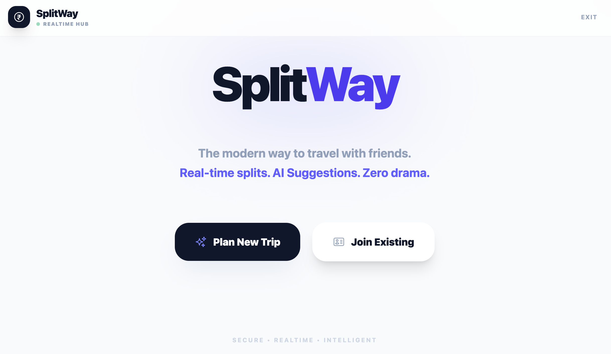
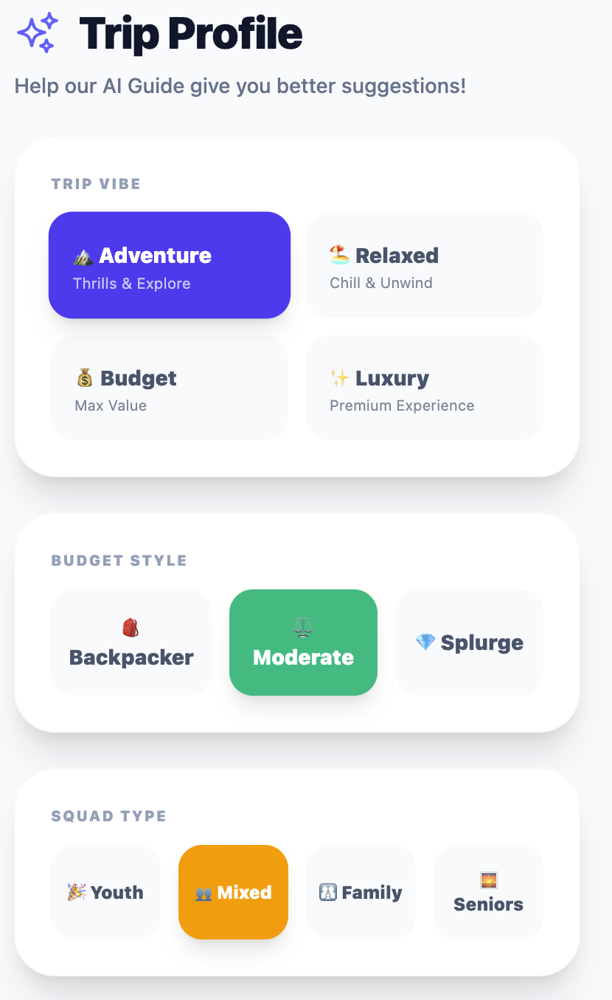
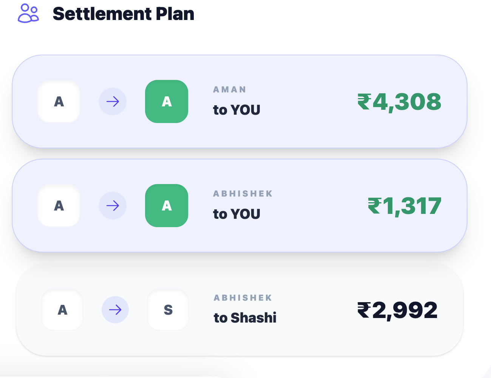

# SplitWay - Smart Trip Expense Splitter 🇮🇳

<div align="center">
  
  <br/>
  
  [](https://reactjs.org/)
  [](https://vitejs.dev/)
  [](https://supabase.com/)
  [](https://tailwindcss.com/)
  [](https://web.dev/progressive-web-apps/)

  <p align="center">
    <b>The ultimate travel companion for India trips.</b><br/>
    Split expenses, get AI travel hacks, and settle debts instantly.
  </p>
</div>

---

## 📸 App Previews

<div align="center">
  
  
  
</div>

## ✨ Key Features

### 💰 Smart Splitting
- **Real-time Expense Tracking:** Add expenses on the go (Cab, Food, Stay, etc.).
- **Optimistic UI:** Instant updates even with spotty network.
- **Fair Settlements:** Algorithm minimizes the number of transactions needed to settle up.

### 🤖 AI Travel Guide (Gemini 2.5 Flash)
- **Personalized Hacks:** Get tips for Goa, Manali, Kerala, etc. based on your budget & style.
- **Smart Fallbacks:** Offline-ready tips ensure you're never lost, even if AI is busy.
- **Auto-Refresh:** Insights update effectively as you spend.

### 📱 PWA & Mobile First
- **Installable:** Add to Home Screen on iOS and Android.
- **Smooth Animations:** Premium app-like feel with 60fps transitions.
- **Haptic Feedback:** Interactive UI elements.

### 🛡️ Secure Admin
- **PIN Protection:** 4-digit PIN for trip admins to prevent accidental deletions.
- **Room IDs:** Simple 6-digit codes for easy sharing.

---

## 🛠️ Tech Stack

- **Frontend:** React + TypeScript + Vite
- **Styling:** Tailwind CSS + Heroicons
- **Backend:** Supabase (PostgreSQL + Realtime)
- **AI:** Google Gemini 2.5 Flash API
- **Deployment:** Netlify / Vercel

---

## 🚀 Getting Started

### 1. Clone & Install
```bash
git clone https://github.com/yourusername/splitway.git
cd splitway
npm install
```

### 2. Environment Setup
Create a `.env` file in the root:
```env
VITE_SUPABASE_URL=your_supabase_url
VITE_SUPABASE_ANON_KEY=your_supabase_anon_key
VITE_GROQ_API_KEY=your_gemini_api_key
```

### 3. Database Setup (Supabase)
Run the following SQL in Supabase SQL Editor:

```sql
-- TRIPS TABLE
create table trips (
  id text primary key,
  name text not null,
  destination text,
  start_date text,
  end_date text,
  creator_id text not null,
  admin_pin text,
  trip_style text,
  budget_type text,
  age_group text,
  created_at timestamp with time zone default timezone('utc'::text, now()) not null
);

-- MEMBERS TABLE
create table members (
  id uuid default uuid_generate_v4() primary key,
  trip_id text references trips(id) on delete cascade,
  user_id text not null,
  name text not null,
  is_creator boolean default false,
  avatar_color text,
  created_at timestamp with time zone default timezone('utc'::text, now()) not null
);

-- EXPENSES TABLE
create table expenses (
  id text primary key,
  trip_id text references trips(id) on delete cascade,
  description text not null,
  amount numeric not null,
  date text not null,
  category text not null,
  payer_id text not null,
  participant_ids text[] not null,
  created_by text,
  created_at timestamp with time zone default timezone('utc'::text, now()) not null
);

-- REALTIME
alter publication supabase_realtime add table trips;
alter publication supabase_realtime add table members;
alter publication supabase_realtime add table expenses;
```

### 4. Run Locally
```bash
npm run dev
```

---

## 📱 PWA Usage
- **iOS:** Open in Safari → Share → Add to Home Screen.
- **Android:** Open in Chrome → Triple dot menu → Install App.

---

## 📄 License
MIT License. Built with ❤️ for travelers.
